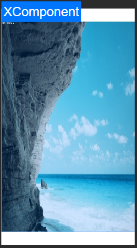

# SDL2

## Introduction
>  SDL2 (Simple DirectMedia Layer 2) is a cross-platform development library for multimedia application and game development.

## Demo


### SDL2

​	GitHub-based SDL2 version (realse-2.0.12):[SDL2 source code link ](https://github.com/libsdl-org/SDL/tree/release-2.0.12).

### How to Build

​	1、git clone -b master https://gitcode.com/openharmony-sig/ohos_sdl2.git;

​	2、DevEco Studio opens the ohos-project journal and configures Migrate;

​	3、Optionally, configure the SDK path of DevEco Studio (DevEco Studio 5.0.3.652 comes with the SDK), and if you need to configure it separately, go to the setting page to configure it;

​	4、Add a signature：file->Project Structure select sign in add a signature;

​	5、Compile and run to generate SD12 libraries.

## How To Use
```ts
   import sdl from 'libSDL2.so';
```
### Configure the XComponent control in the UI
```ts
	Stack({ alignContent: Alignment.TopStart }) {
	  XComponent({
		id: 'RootXC',
		type: XComponentType.NODE,
		libraryname: 'SDL2'
	  })
		.onAppear(() => {
		  let scaledDensity = display.getDefaultDisplaySync().scaledDensity;
		  display.on('change', (id: number) => {
			const densityDPI = display.getDefaultDisplaySync().densityDPI.toString()
			const scaledDensity = display.getDefaultDisplaySync().scaledDensity.toString()
			const densityPixels = display.getDefaultDisplaySync().densityPixels.toString()
			const xDPI = display.getDefaultDisplaySync().xDPI.toString()
			const yDPI = display.getDefaultDisplaySync().yDPI.toString()
			const widthStr = display.getDefaultDisplaySync().width.toString()
			const heightStr = display.getDefaultDisplaySync().height.toString()
			console.log('densityDPI(Displays the physical pixel density of the device's screen, representing the number of pixels per inch):' + densityDPI
			  + '\nscaledDensity(Displays the zoom factor of the display font of the device):' + scaledDensity
			  + '\ndensityPixels(Displays the density of the device's logical pixels, representing the scale factor of the physical pixels versus the logical pixels):' + densityPixels
			  + '\nxDPI(The exact physical pixel value per inch of the screen in the x-direction):' + xDPI
			  + '\nyDPI(The exact physical pixel value per inch of the screen in the y-direction):' + yDPI
			  + '\nwidth:' + widthStr
			  + '\nheight:' + heightStr)

		  })
		  sdl.setScaledDensity(scaledDensity)
		  sdl.createNativeNode('RootXC', this.mWidth, this.mHeight, this.x, this.y)
		  console.log("test createNativeNode")
		  notifySdlAboutToAppear(getContext(this))
		})
		.width('100%')
		.height('100%')
		.id('RootXComponent')
		.backgroundColor(Color.Yellow)
	}
```

### Create Nested Windows
```c++
    // Load the image file
    original = SDL_ConvertSurfaceFormat(SDL_LoadBMP("testyuv.bmp"), SDL_PIXELFORMAT_RGB24, 0);
    // Create nested windows
    window = SDL_CreateWindowFrom((void *)WinId());
    // Build a renderer
    renderer = SDL_CreateRenderer(window, -1, 0);
    // Create a texture
    output = SDL_CreateTextureFromSurface(renderer, original);
    // The texture is copied to the renderer
    SDL_RenderClear(renderer);
    SDL_RenderCopy(renderer, output, NULL, NULL);
    SDL_SetRenderDrawColor(renderer, 0xFF, 0xFF, 0xFF, 0xFF);
    // Displays the texture
	SDL_RenderPresent(renderer);
	// Free up resources
	SDL_DestroyTexture(output);
    SDL_DestroyRenderer(renderer);
    SDL_DestroyWindow(window);
```
### Play The Audio File
```c++
	// Load the audio file
	SDL_LoadWAV("dynamic2.wav", &wave.spec, &wave.sound, &wave.soundlen);
	// Set the audio playback callback
	wave.spec.callback = fillerup;
	// Turn on your audio device
	device = SDL_OpenAudioDevice(NULL, SDL_FALSE, &wave.spec, NULL, 0);
	// Start playing
	SDL_PauseAudio(SDL_FALSE);
	// Turn off the playback device
	SDL_CloseAudioDevice(device);
```

## API Description

​	In order to meet the needs of specific users, only some interfaces in the SDL2 library have been adapted. If you need to use an unadapted interface, please contact us. Currently, a total of 74 interfaces have been adapted, covering specific interfaces of modules such as basic capabilities, windows, audio and video, and rendering, as follows:

### SDL2 Open Source Library Basic Capabilities Are Ported And Adapted

| API                | SDL Wiki                                        |
| ------------------ | ----------------------------------------------- |
| SDL_memset         | https://wiki.libsdl.org/SDL2/SDL_memset         |
| SDL_GL_LoadLibrary | https://wiki.libsdl.org/SDL2/SDL_GL_LoadLibrary |
| SDL_Delay          | https://wiki.libsdl.org/SDL2/SDL_Delay          |
| SDL_getenv         | https://wiki.libsdl.org/SDL2/SDL_getenv         |
| SDL_Init           | https://wiki.libsdl.org/SDL2/SDL_Init           |
| SDL_WasInit        | https://wiki.libsdl.org/SDL2/SDL_WasInit        |
| SDL_InitSubSystem  | https://wiki.libsdl.org/SDL2/SDL_InitSubSystem  |
| SDL_RectEmpty      | https://wiki.libsdl.org/SDL2/SDL_RectEmpty      |
| SDL_LogSetPrior    | https://wiki.libsdl.org/SDL2/SDL_LogSetPriority |
| SDL_SetHint        | https://wiki.libsdl.org/SDL2/SDL_SetHint        |
| SDL_Quit           | https://wiki.libsdl.org/SDL2/SDL_Quit           |
| SDL_GetError       | https://wiki.libsdl.org/SDL2/SDL_GetError       |


### SDL2 Open-source Library Multi-threaded Concurrency, Timer Asynchronous Function Porting Adaptation
| API                  | SDL Wiki                                          |
| -------------------- | ------------------------------------------------- |
| SDL_CreateThread     | https://wiki.libsdl.org/SDL2/SDL_CreateThread     |
| SDL_WaitThread       | https://wiki.libsdl.org/SDL2/SDL_WaitThread       |
| SDL_CreateMutex      | https://wiki.libsdl.org/SDL2/SDL_CreateMutex      |
| SDL_LockMutex        | https://wiki.libsdl.org/SDL2/SDL_LockMutex        |
| SDL_UnlockMutex      | https://wiki.libsdl.org/SDL2/SDL_UnlockMutex      |
| SDL_DestroyMutex     | https://wiki.libsdl.org/SDL2/SDL_DestroyMutex     |
| SDL_CreateCond       | https://wiki.libsdl.org/SDL2/SDL_CreateCond       |
| SDL_CondSignal       | https://wiki.libsdl.org/SDL2/SDL_CondSignal       |
| SDL_CondBroadcast    | https://wiki.libsdl.org/SDL2/SDL_CondBroadcast    |
| SDL_CondWait         | https://wiki.libsdl.org/SDL2/SDL_CondWait         |
| SDL_CondWaitTimeout  | https://wiki.libsdl.org/SDL2/SDL_CondWaitTimeout  |
| SDL_DestroyCond      | https://wiki.libsdl.org/SDL2/SDL_DestroyCond      |
| SDL_CreateSemaphore  | https://wiki.libsdl.org/SDL2/SDL_CreateSemaphore  |
| SDL_SemPost          | https://wiki.libsdl.org/SDL2/SDL_SemPost          |
| SDL_SemWait          | https://wiki.libsdl.org/SDL2/SDL_SemWait          |
| SDL_DestroySemaphore | https://wiki.libsdl.org/SDL2/SDL_DestroySemaphore |
| SDL_AddTimer         | https://wiki.libsdl.org/SDL2/SDL_AddTimer         |
| SDL_RemoveTimer      | https://wiki.libsdl.org/SDL2/SDL_RemoveTimer      |

### SDL2 Open Source Library Event Function Porting Adaptation

| API       | SDL Wiki           |
|-----------|--------------------|
| SDL_PushEvent | https://wiki.libsdl.org/SDL2/SDL_PushEvent |
| SDL_FlushEvents | https://wiki.libsdl.org/SDL2/SDL_FlushEvents |
| SDL_EventState | https://wiki.libsdl.org/SDL2/SDL_EventState |

### SDL2 Open Source Library Audio Function Porting And Adaptation

| API                      | SDL Wiki                                              |
| ------------------------ | ----------------------------------------------------- |
| SDL_OpenAudioDevice      | https://wiki.libsdl.org/SDL2/SDL_OpenAudioDevice      |
| SDL_MixAudio             | https://wiki.libsdl.org/SDL2/SDL_MixAudio             |
| SDL_PauseAudioDevice     | https://wiki.libsdl.org/SDL2/SDL_PauseAudioDevice     |
| SDL_CloseAudioDevice     | https://wiki.libsdl.org/SDL2/SDL_CloseAudioDevice     |
| SDL_GetNumAudioDevices   | https://wiki.libsdl.org/SDL2/SDL_GetNumAudioDevices   |
| SDL_GetAudioDeviceName   | https://wiki.libsdl.org/SDL2/SDL_GetAudioDeviceName   |
| SDL_GetAudioDeviceStatus | https://wiki.libsdl.org/SDL2/SDL_GetAudioDeviceStatus |
| SDL_LockAudioDevice      | https://wiki.libsdl.org/SDL2/SDL_LockAudioDevice      |
| SDL_UnlockAudioDevice    | https://wiki.libsdl.org/SDL2/SDL_UnlockAudioDevice    |

### SDL2 Open Source Library Window Function Porting Adaptation

| API                   | SDL Wiki                                           |
| --------------------- | -------------------------------------------------- |
| SDL_CreateWindow      | https://wiki.libsdl.org/SDL2/SDL_CreateWindow      |
| SDL_DestroyWindow     | https://wiki.libsdl.org/SDL2/SDL_DestroyWindow     |
| SDL_CreateWindowFrom  | https://wiki.libsdl.org/SDL2/SDL_CreateWindowFrom  |
| SDL_SetWindowPosition | https://wiki.libsdl.org/SDL2/SDL_SetWindowPosition |
| SDL_GetWindowPosition | https://wiki.libsdl.org/SDL2/SDL_GetWindowPosition |
| SDL_SetWindowSize     | https://wiki.libsdl.org/SDL2/SDL_SetWindowSize     |
| SDL_GetWindowSize     | https://wiki.libsdl.org/SDL2/SDL_GetWindowSize     |
| SDL_ShowWindow        | https://wiki.libsdl.org/SDL2/SDL_ShowWindow        |
| SDL_GetWindowFlags    | https://wiki.libsdl.org/SDL2/SDL_GetWindowFlags    |
| SDL_GetWindowID       | https://wiki.libsdl.org/SDL2/SDL_GetWindowID       |
| SDL_HideWindow        | https://wiki.libsdl.org/SDL2/SDL_HideWindow        |

### SDL2 Open Source Library Window Management Function Porting Adaptation

| API                    | SDL Wiki                                            |
| ---------------------- | --------------------------------------------------- |
| SDL_CreateSystemCursor | https://wiki.libsdl.org/SDL2/SDL_CreateSystemCursor |
| SDL_SetCursor          | https://wiki.libsdl.org/SDL2/SDL_SetCursor          |
| SDL_ShowCursor         | https://wiki.libsdl.org/SDL2/SDL_ShowCursor         |

### SDL2 Open-source Library Texture Management Function Porting Adaptation

| API                     | SDL Wiki                                             |
| ----------------------- | ---------------------------------------------------- |
| SDL_CreateTexture       | https://wiki.libsdl.org/SDL2/SDL_CreateTexture       |
| SDL_LockTexture         | https://wiki.libsdl.org/SDL2/SDL_LockTexture         |
| SDL_UnlockTexture       | https://wiki.libsdl.org/SDL2/SDL_UnlockTexture       |
| SDL_SetTextureBlendMode | https://wiki.libsdl.org/SDL2/SDL_SetTextureBlendMode |
| SDL_UpdateYUVTexture    | https://wiki.libsdl.org/SDL2/SDL_UpdateYUVTexture    |
| SDL_DestroyTexture      | https://wiki.libsdl.org/SDL2/SDL_DestroyTexture      |

### SDL2 open source library rendering function porting adaptation

| API                    | SDL Wiki                                            |
| ---------------------- | --------------------------------------------------- |
| SDL_RenderReadPixels   | https://wiki.libsdl.org/SDL2/SDL_RenderReadPixels   |
| SDL_RenderSetClipRect  | https://wiki.libsdl.org/SDL2/SDL_RenderSetClipRect  |
| SDL_RenderClear        | https://wiki.libsdl.org/SDL2/SDL_RenderClear        |
| SDL_RenderPresent      | https://wiki.libsdl.org/SDL2/SDL_RenderPresent      |
| SDL_RenderFlush        | https://wiki.libsdl.org/SDL2/SDL_RenderFlush        |
| SDL_RenderGetViewport  | https://wiki.libsdl.org/SDL2/SDL_RenderGetViewport  |
| SDL_SetRenderDrawColor | https://wiki.libsdl.org/SDL2/SDL_SetRenderDrawColor |
| SDL_RenderCopy         | https://wiki.libsdl.org/SDL2/SDL_RenderCopy         |
| SDL_CreateRenderer     | https://wiki.libsdl.org/SDL2/SDL_CreateRenderer     |
| SDL_SetRenderTarget    | https://wiki.libsdl.org/SDL2/SDL_SetRenderTarget    |
| SDL_DestroyRenderer    | https://wiki.libsdl.org/SDL2/SDL_DestroyRenderer    |
| SDL_RenderCopyEx       | https://wiki.libsdl.org/SDL2/SDL_RenderCopyEx       |

## Constraints

This project has been verified in the following version:
- DevEco Studio 5.0.0 Release --SDK:API12.

## Directory Structure

```sdl
.
|	└── ohos-project
|		├── build-profile.json5
|		├── entry
|		│   └── src
|		│       └── main
|		│           ├── cpp
|		│           │   ├── ohos_sdl2                            SDL2 adapts the source code
|		│           │   │   ├── CMakeLists.txt
|		│           │   │   ├── ohos-project
|		│           │   │   │   │   └── src
|		│           │   │   │   │       └── main
|		│           │   │   │   │           ├── cpp
|		│           │   │   │   │           │   ├── CMakeLists.txt
|		│           │   │   │   │           │   ├── application           Execution test case
|		│           │   │   │   │           ├── ets
|		│           │   │   │   │           │   ├── pages
|		│           │   │   │   │           │   │   └── Index.ets
|		│           │   │   │   │   audio       │   └── service           ETS interface features
|		│           │   │   │   │   ├── ohos                              Audio adaptation
|		│           │   │   │   ├── core
|		│           │   │   │   │   ├
|		│           │   │   │   │   ├── ohos                              xcompoent management
|		│           │   │   │   │   │   └── adapter_c
|		│           │   │   │   │   │       ├── AdapterC.cpp
|		│           │   │   │   │   │       └── AdapterC.h
|									video	
|							        ├── ohos                              Video  adaptation
|					   
```

## How to Contribute

If you find any problem during the use, submit an[Issue](https://gitee.com/openharmony-sig/ohos_sdl2/issues) or a [PR](https://gitee.com/openharmony-sig/ohos_sdl2/pulls)to us.

## License

This project is based on [Zlib License](LICENSE).


